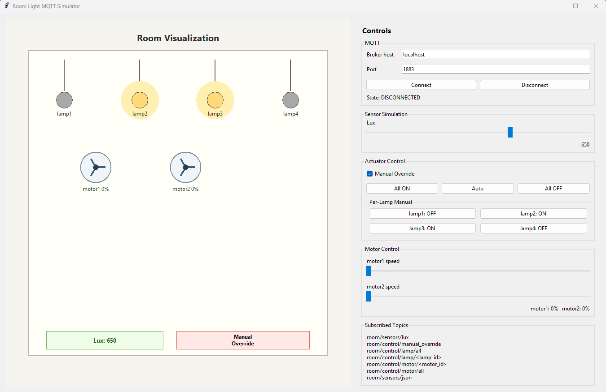

# Room Light MQTT Simulator

Interactive Python simulation of a room with 4 lamps and 2 motors, visualized with Tkinter and driven by MQTT.

## UI Preview



## Features

- **4 lamps** drawn inside a room canvas
- **Lux-based brightness**: lux 0 = transparent, lux 1000 = full yellow glow
- **2 animated motors**: spin speed proportional to speed value (0–100)
- **Auto mode**: lamps always ON; MQTT lux and per-lamp commands control the room
- **Manual override mode**: UI lux slider and per-lamp toggle buttons become active; MQTT lux/lamp messages are ignored
- `room/control/manual_override` **always accepted in both modes** — send `0` to return to auto from MQTT even when manual override is active
- Motor speed commands always work in both modes

## Modes at a glance

| | Auto | Manual Override |
|---|---|---|
| Lamps | MQTT-driven (ON/OFF per lamp or all) | Toggled per-lamp via UI only |
| Lux | MQTT-driven | UI slider only |
| Motor | MQTT-driven | MQTT-driven |
| `room/control/manual_override` | Always accepted | Always accepted |
| MQTT lux/lamp messages | Applied | Ignored |

## MQTT Topics

| Topic | Payload | Notes |
|---|---|---|
| `room/sensors/lux` | `0`–`1000` | Auto mode only |
| `room/control/manual_override` | `1` / `0` | **Always accepted in both modes** |
| `room/control/lamp/all` | `ON` / `OFF` / `AUTO` | Auto mode only |
| `room/control/lamp/<id>` | `ON` / `OFF` | Auto mode only (lamp IDs: `lamp1`–`lamp4`) |
| `room/control/motor/all` | `0`–`100` | Always accepted |
| `room/control/motor/<id>` | `0`–`100` | Always accepted (IDs: `motor1`, `motor2`) |
| `room/sensors/json` | JSON object | Auto mode for lux/lamps; motors always |

JSON example:
```json
{"lux": 800, "manual_override": false, "motor1_speed": 20, "motor2_speed": 95}
```

## Run

```powershell
pip install -r requirements.txt
python app.py
```

Optional — create a virtual environment first:
```powershell
python -m venv .venv
.\.venv\Scripts\Activate.ps1
pip install -r requirements.txt
python app.py
```

## Notes
- Default broker: `localhost:1883`
- If `paho-mqtt` is missing, the UI still opens; MQTT connect will show an error.
- Broker can be changed in the UI before connecting.
